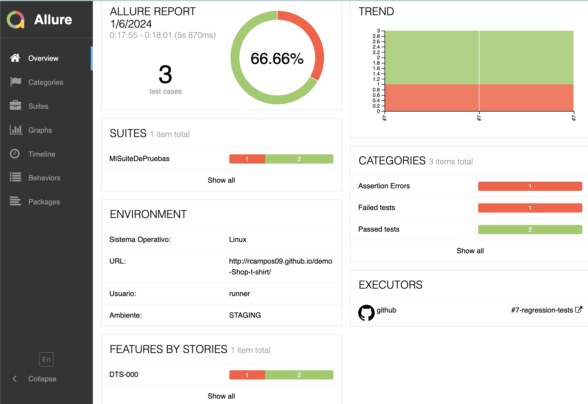

# SeleniumDonTester

Este proyecto, denominado SeleniumDonTester, utiliza Selenium, TestNG y Allure Report para realizar pruebas automatizadas en un sitio web. A continuación, se proporciona información sobre cómo configurar y ejecutar las pruebas, así como detalles sobre el caso de prueba de ejemplo.

## Configuración del Proyecto

Asegúrese de tener instaladas las siguientes herramientas antes de ejecutar las pruebas:

- [Java](https://www.oracle.com/java/technologies/javase-downloads.html)
- [Maven](https://maven.apache.org/download.cgi)

## Dependencias

El proyecto utiliza las siguientes dependencias, que se pueden encontrar en el archivo `pom.xml`:

- Selenium WebDriver
- TestNG
- Allure TestNG

Asegúrese de que Maven descargue las dependencias antes de ejecutar las pruebas ejecutando el siguiente comando:

```bash
mvn clean install -U -DskipTests
```

## Ejecución de Pruebas
Para ejecutar las pruebas, ejecute el siguiente comando en la raíz del proyecto:

```bash
mvn test -Dtest=TestClass
```
Este comando ejecutará las pruebas definidas en la clase TestClass. Asegúrese de que el WebDriver esté configurado correctamente en la clase ConfigClass.


## Informe Allure
Después de ejecutar las pruebas, genere el informe Allure con el siguiente comando:

* brew install Allure
* allure generate target/allure-results
* allure server target/allure-results
  
Esto abrirá el informe en el navegador web y le proporcionará detalles visuales sobre el resultado de las pruebas.

Resultado de Reporte:


**Firma:** Rodrigo Campos Tapia [@DonTester]

**Sígueme en mis redes sociales:**

[](https://www.instagram.com/dontester_/) **Instagram** &nbsp; &nbsp;
[](https://twitter.com/DonTester_) **Twitter** &nbsp; &nbsp;
[](https://www.linkedin.com/in/rcampostapia) **LinkedIn** &nbsp; &nbsp;
[](https://github.com/rcampos09) **GitHub** &nbsp; &nbsp;
[](https://www.youtube.com/@dontester) **YouTube** &nbsp; &nbsp;
[](https://medium.com/@rcampos.tapia) **Medium**
