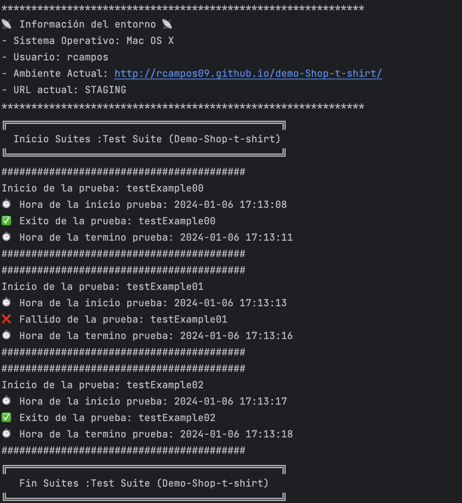

# Selenium Allure Java Maven (by DonTester)

"Este proyecto, denominado SeleniumAllureJavaMaven, utiliza Selenium, TestNG, Allure Report, Chrome --headless o 
Selenoid Hub, para realizar pruebas automatizadas en un sitio web. 
Ejemplo: https://rcampos09.github.io/demo-Shop-t-shirt/index.html. 
A continuación, se proporciona información sobre cómo configurar y ejecutar las pruebas, 
así como detalles sobre el caso de prueba de ejemplo."

## Configuración del Proyecto

Asegúrese de tener instaladas las siguientes herramientas antes de ejecutar las pruebas:

- [Java ](https://www.oracle.com/java/technologies/javase-downloads.html)
- [Maven](https://maven.apache.org/download.cgi)
- [Docker Desktop](https://www.docker.com/products/docker-desktop/)
- [IntelliJ IDEA Community Edition](https://www.jetbrains.com/products/compare/?product=idea&product=idea-ce)
- [Selenoid HUb](https://maven.apache.org/download.cgi)

## Dependencias

El proyecto utiliza las siguientes dependencias, que se pueden encontrar en el archivo pom.xml:

- Selenium WebDriver [
  Selenium WebDriver automatiza interacciones en navegadores web.]
- TestNG [TestNG es un marco de pruebas para Java que facilita la ejecución y organización de pruebas unitarias y de integración.]
- Allure TestNG [Informes visuales para pruebas TestNG]
- TestNG [Marco de pruebas Java con funciones avanzadas y generación de informes.]
- SLF4J [Interfaz de registro de eventos en Java para abstracción de sistemas de registro.]
- Logback: [Marco de registro Java con configuración flexible y eficiente.]
- json-simple: [Biblioteca Java ligera para manipular datos en formato JSON.]
- Surefire: [Plugin Maven para ejecución y reporte de pruebas unitarias en Java.]
- AspectJ: [Extensión de Java para la programación orientada a aspectos (AOP).]
- compiler-plugin: [Plugin Maven para compilar el código fuente en un proyecto.]

Ahora, asegúrese de que Maven descargue las dependencias antes de ejecutar las pruebas ejecutando el siguiente comando:

```bash
mvn clean install -U -DskipTests
```

## Preparacion del Ambiente
Para realizar las ejecuciones de forma local usando Selenoid Hub, utilice el siguiente comando:

```bash
mvn test -Dtest=TestClass -Dremote=true
```
Para realizar las ejecuciones de forma local usando ChromeDriver --headless, utilice el siguiente comando::

```bash
mvn test -Dtest=TestClass -Dremote=false 
```

## Ejecución de Pruebas
Para ejecutar las pruebas, use el siguiente comando en la raíz del proyecto:

```bash
mvn test -Dtest=TestClass -Dremote=false
```
Este comando ejecutará las pruebas definidas en la clase TestClass. Asegúrese de que el WebDriver
esté configurado correctamente en la clase ConfigClass.

## Console-log
Se agrega un log más moderno usando emojis, implementando un Listener de TestNG para mostrar resultados.:

Resultado de console-log:



## Monitor Selenoid (Docker)
Una vez descargado, he instalado el servicio de Selenoid (Servicio y UI).
Consola Docker:


Consola Selenoid UI:


## Informe Allure
Después de ejecutar las pruebas, genere el informe Allure instalando y ejecutando el comando::

1. Instala Allure utilizando el siguiente comando (hacer solo una vez):
   ```bash
   brew install Allure

2. Utiliza el siguiente comando para generar el informe en HTML (ver carpeta de salida):
   ```bash
   allure generate target/allure-results

3. Si prefieres visualizar el informe directamente a través de un servidor, ejecuta el siguiente comando (Ver IP servidor):
   ```bash
   allure serve target/allure-results

Esto abrirá el informe en el navegador web y le proporcionará detalles visuales sobre el resultado de las pruebas.

Resultado de Reporte:


## Github-Actions y GiyHUb-Page Allure
Las siguientes etapas hacen referencia a cómo está estructurado el conjunto de pasos (Steps) del CI/CD con GitHub Actions.
En esta ejecución, se utiliza Chrome --headless, lo que nos ayuda a evitar levantar el navegador de forma local.

```bash
Pipeline: Selenium Test

┌ Stage: Build
│
├──── Step: Checkout repository
│
├──── Step: Set up JDK (Java 11)
│
├──── Step: Install Chrome
│
├──── Step: Install ChromeDriver
│
├──── Step: Install Allure
│
├──── Step: Get history allure
│
└──── Step: Run Selenium Tests And Report
│
└──── Substep: Disable error detection
│
└──── Substep: Clone repository for gh-pages
│
└──── Substep: Run Selenium Tests
│
└──── Substep: Enable error detection
│
└──── Substep: Copy history to Allure results
│
└──── Substep: Generate Allure report

┌ Stage: Deploy to GitHub Pages
│
└──── Step: Deploy to GitHub Pages
```


**Firma:** Rodrigo Campos Tapia [@DonTester]

**Sígueme en mis redes sociales:**

[](https://www.instagram.com/dontester_/) **Instagram** &nbsp; &nbsp;
[](https://twitter.com/DonTester_) **Twitter** &nbsp; &nbsp;
[](https://www.linkedin.com/in/rcampostapia) **LinkedIn** &nbsp; &nbsp;
[](https://github.com/rcampos09) **GitHub** &nbsp; &nbsp;
[](https://www.youtube.com/@dontester) **YouTube** &nbsp; &nbsp;
[](https://medium.com/@rcampos.tapia) **Medium**
